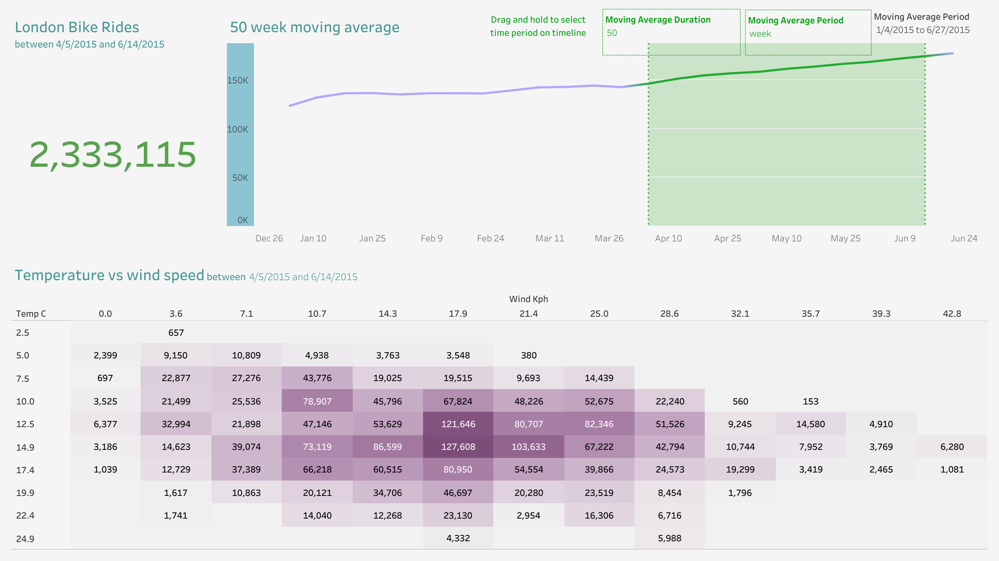
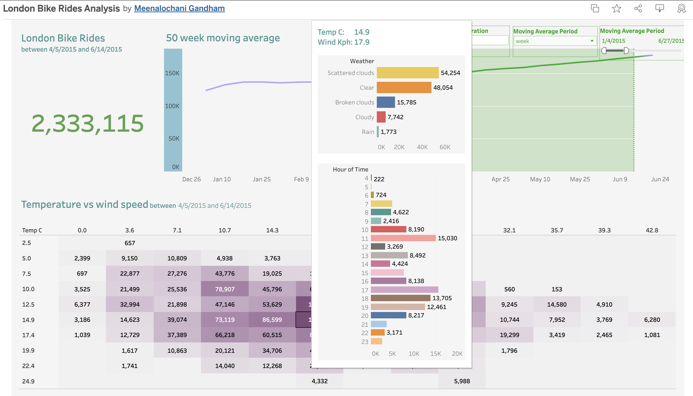

# London Bike Rides Analysis
## Overview 
This Tableau dashboard provides insights into **London's bike rides** data, analyzing trends, peak hours, and weather effects on cycling patterns.
## View the Interactive Dashboard
[Click here to view the dashboard on Tableau Public](https://public.tableau.com/app/profile/meenalochani.gandham/viz/LondonBikeRidesAnalysis_17382810283260/Dashboard?publish=yes)

## Dashboard Preview

## Key Insights:
- **Peak Ride Hours:** The highest number of bike rides occur between **7 AM - 9 AM** and **5 PM - 7 PM**.
- **Seasonal Trends:** Summer months see a significant increase in cycling.
- **Weather Impact:** Rainy days show a drop in bike usage.

## Files in This Repository
- `README.md` - Documentation
- `dashboard_preview.png` - Dashboard Screenshot
- `index.html` (Optional) - Embedded Tableau Dashboard for GitHub Pages

## About This Project
Created by **Meenalochani Gandham** as part of a data visualization exercise.
